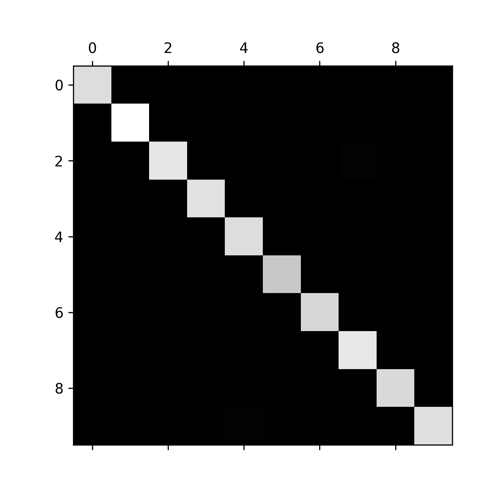
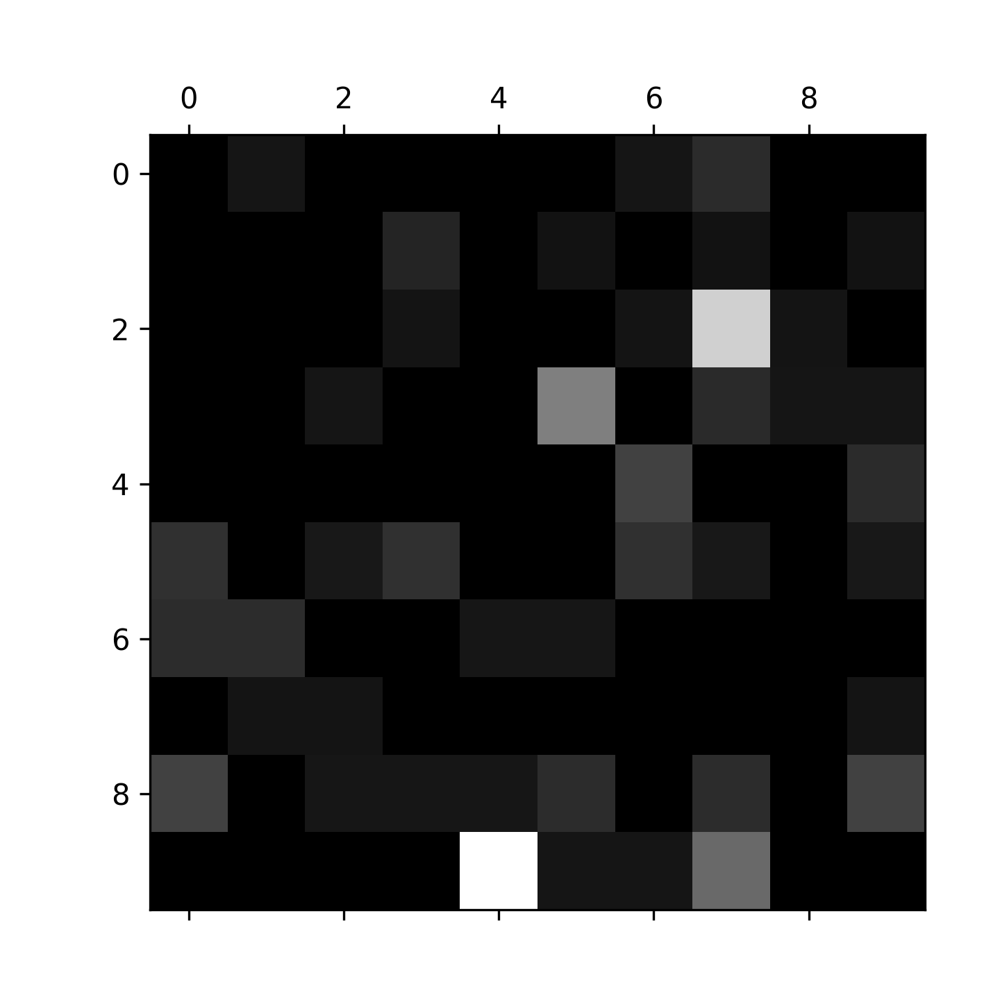

<p align="center">
  
</p>

# Digit-Inator
The Digit-Inator allows you to convert your favorite hand drawn digit to text with the latest and greatest in computer vision.

<p align="center">
  
  <br />
  <a href="https://digit-inator.netlify.app/">Try out the Digit-Inator</a>
</p>

## Table of Contents
* [Web Application Installation](#web-application-installation)
* [Run the Application Locally](#run-the-application-locally)
* [Run Tests](#run-tests)
  + [Run Unit Tests](#run-unit-tests)
  + [Run Integration Tests](#run-integration-tests)
* [Run the Application in Production Mode](#run-the-application-in-production-mode)
* [Web Technology](#web-technology)
* [Deep Learning Technology](#deep-learning-technology)
* [Number Detection Model Details](#number-detection-model-details)
  + [Confusion Matrix Plot](#confusion-matrix-plot)
  + [Confusion Matrix Error Plot](#confusion-matrix-error-plot)
* [Modify the Number Detection Model](#modify-the-number-detection-model)
  + [Prerequisites](#prerequisites)
  + [Steps](#steps)
* [Edit the Logo](#edit-the-logo)

## Web Application Installation
1. Install [npm](https://www.npmjs.com/get-npm)
2. Install [yarn](https://classic.yarnpkg.com/en/docs/install/#windows-stable) 
3. Run `yarn` at the root of the project to install dependencies

## Run the Application Locally
1. Run `yarn dev` at the root of the project to start the application
3. Navigate to `http://localhost:3000/` to view the application

## Run Tests
### Run Unit Tests
1. Run `yarn test:unit` at the root of the project
### Run Integration Tests
1. Run `yarn test:integration` at the root of the project
2. In the Cypress runner, click the test suite you want to run or click "Run all specs"

## Run the Application in Production Mode
1. Run `yarn build` at the root of the project
2. Run `yarn start` at the root of the project

## Web Technology
* Next.js (React)
* TensorFlow.js
* TypeScript
* SCSS Modules
* Jest
* React Testing Library
* Cypress

## Deep Learning Technology
* TensorFlow
* Keras
* MNIST dataset
* Convolutional Neural Network (CNN)

## Number Detection Model Details
**Model Accuracy**: 99.120%
### Confusion Matrix Plot

### Confusion Matrix Error Plot


## Modify the Number Detection Model
### Prerequisites
Python, version between 3.7 and 3.9 exclusive
### Steps
1. Run `pip install -r number_detection_model/requirements.txt`

2. Build the model by running `python number_detection_model/build_model.py`

   > *NOTE:* Building the model takes around 5 minutes in its current state. It generates a `number_detection_model.h5` file.

3. Run `python number_detection_model/test_model.py`

   > *NOTE:* Creates images for confusion matrices that can be found in the `number_detection_model` directory.

4. Convert the `.h5` model into `.json` and make it available to the web application by running the following command:

```
tensorflowjs_converter --input_format=keras --output_format=tfjs_layers_model number_detection_model.h5 ./public/model
```

## Edit the Logo
Install [AdobeXD](https://www.adobe.com/products/xd.html) to build off of the current `.xd` file in the `design` directory.
